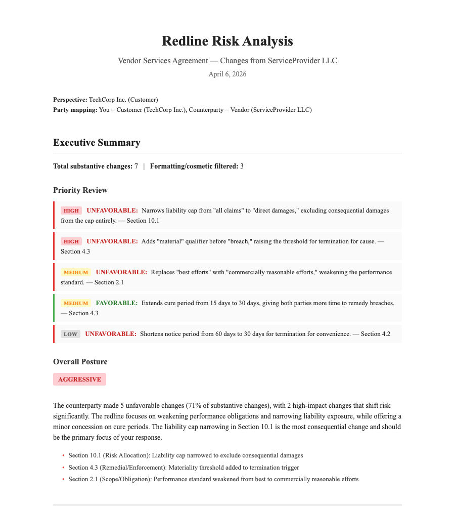
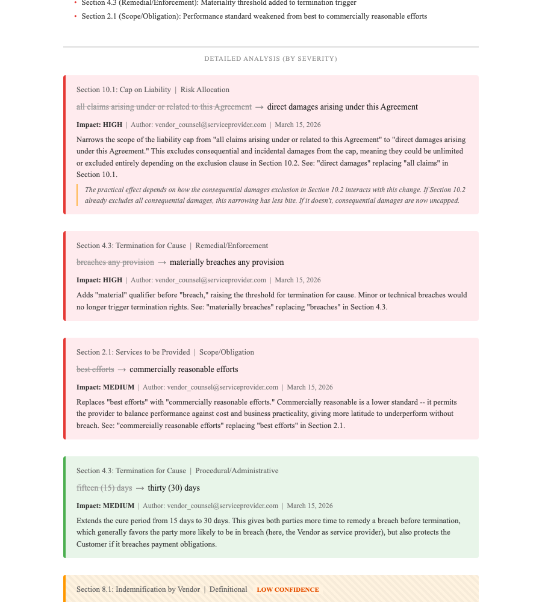

# Redline Risk

A Copilot CLI plugin that color-codes tracked changes in a contract by their directional impact on your position. Instead of telling you what changed, it tells you whether each change helps or hurts you.


*Summary with priority review list and posture assessment for a synthetic vendor agreement.*

## What it does

When you receive a redlined contract from the other side, every change needs manual evaluation. You read each insertion, deletion, and modification and mentally assess: does this strengthen my position, weaken it, or not matter?

Redline Risk makes that assessment visible. You give Copilot a tracked-changes document and tell it which side you represent. It produces a Word document where:

- Each tracked change is color-coded on a gradient from green (favors you) through gray (neutral) to red (favors the counterparty)
- Each change has a brief annotation explaining why it helps or hurts, citing the specific language
- A summary section shows the priority changes that need attention, grouped by category and severity
- Changes the model is uncertain about are marked with a striped pattern rather than a solid color, signaling "look at this yourself"

The original text is preserved. Nothing is rewritten. The augmentation is purely visual.


*Change-by-change analysis sorted by severity. Each change shows the old and new text, impact level, category, author, and an explanation of the legal effect. The striped entry at the bottom is a low-confidence assessment.*

## How it differs from existing tools

Most contract review tools score clauses for risk against a playbook. They answer "is this clause risky?" That's the wrong question during redline review.

A limitation of liability clause might be unfavorable, but if the counterparty's edit made it slightly less unfavorable, that edit is a win. Conversely, a standard indemnification clause might get a narrow carve-out inserted that clause-level tools would still rate as "standard" because the clause as a whole looks fine -- but the change itself is meaningful.

The unit of analysis should be the edit, not the clause.

Redline Risk analyzes individual edits (insertions, deletions, modifications) and scores them relative to which party you represent. No playbooks required -- it reads the contract and your party context.

## Installation

### Prerequisites

- Python 3.7 or later
- pip (Python package manager)

### Setup

Point your CLI at this repo and ask it to install the plugin for you, with this prompt:

```
Install the plugin at github.com/dvelton/redline-risk for me.
```

Or:


Clone this repository or install the plugin through Copilot CLI:

```bash
# Install dependencies
bash setup.sh

# Or on Windows
powershell -File setup.ps1

# Verify installation
python3 skills/redline-risk/tools/redline_risk.py setup-check
```

## Usage

### Basic workflow

1. Tell Copilot which party you represent
2. Provide a Word document with tracked changes (or two versions of the same contract)
3. Copilot extracts the changes, analyzes each one, and produces a color-coded report

### Example

```
Use redline-risk on vendor-agreement-v2.docx. I represent the Client.
```

Copilot will:
1. Extract all tracked changes from the document
2. Read the full contract to understand context
3. Assess each change's impact on your position
4. Produce a Word document on your Desktop with color-coded changes and a priority review list

### Two-file comparison mode

If the document has already-accepted changes (no tracked revisions), provide both versions:

```
Use redline-risk to compare vendor-agreement-v1.docx and vendor-agreement-v2.docx. I represent the Client.
```

## What you get

The output document includes:

1. **Title page** with your party perspective and entity mapping
2. **Executive summary**:
   - Total change count
   - Priority review list (top changes by impact)
   - Overall posture assessment (aggressive / defensive / balanced / cleanup)
   - Changes requiring additional review (low confidence)
3. **Detailed analysis by severity** (sorted by impact score, for triage)
4. **Detailed analysis by document order** (for reading alongside the original)

Each change shows:
- Color-coded background (green/gray/red)
- Impact label (HIGH/MEDIUM/LOW)
- Category (scope/obligation, risk allocation, procedural, definitional, remedial)
- Explanation of the legal effect
- Author and date (when available)

## Color mapping

- **Green** = Favors you
- **Gray** = Neutral
- **Red** = Favors counterparty
- **Light/striped** = Low confidence (review yourself)

## How it works

### Change extraction

The tool parses the raw OOXML inside the .docx file to extract tracked changes. Word stores revisions as `w:ins` (insertions), `w:del` (deletions), `w:moveFrom`/`w:moveTo` (moves), and formatting changes. The standard python-docx library silently discards all of this, so we use lxml to parse the XML directly.

### Change grouping

Related changes are grouped together:
- Insert/delete pairs in the same paragraph by the same author are grouped as replacements
- Move operations are paired by revision ID
- Formatting-only changes are separated
- Cosmetic edits (rewording without changing meaning) are flagged

### Risk assessment

For each change, Copilot:
1. Classifies it by category (scope/obligation, risk allocation, procedural, definitional, remedial)
2. Assesses direction (does this favor you, the counterparty, or neither?)
3. Scores impact (0.0-1.0 scale)
4. Determines confidence level
5. Writes an explanation citing the specific language

Common patterns are recognized automatically (e.g., "best efforts" changing to "commercially reasonable efforts" is a standard weakening of obligation).

## Limitations

- The tool works with any language mechanically (extraction, grouping, color-coding), but the quality of assessment is optimized for English-language contracts
- Very large contracts (200+ pages) may exceed comfortable context limits. The tool handles this by reading the full contract once for structure, then assessing changes section by section.
- Assessment quality depends on having sufficient contract context. The tool reads the full agreement, but if key business context is missing (e.g., deal size, which affects whether a liability cap is meaningful), it will mark those assessments as low confidence.

## License

MIT
